# Restaurant Price Trends

> **Codyssey M1-1 · AI 데이터 분석: 데이터 기반 트렌드 분석**  
> OECD 소비자물가지수로 한국·미국·일본·영국·독일·프랑스의 외식 물가를 2015~2024년 월별로 비교하고, 코로나19와 두 전쟁(러시아-우크라이나, 이스라엘-하마스) 전후의 변화를 분석한 시계열 분석 프로젝트입니다.
>
> **🔗 웹 대시보드:** https://qjskffj-code.github.io/codyssey_M1-1/

<p align="center">
  
  
  
  
  
  
  <a href="https://qjskffj-code.github.io/codyssey_M1-1/"></a>
</p>

---

## Summary

| 구분 | 내용 |
|---|---|
| 해결한 문제 | "외식비가 너무 올랐다"는 체감이 한국만의 현상인지, 전쟁 때문인지 데이터로 확인하기 어려운 문제 |
| 분석 형태 | Python 시계열 분석 (Jupyter Notebook) + Markdown 리포트 |
| 데이터 | OECD 소비자물가지수, 음식 및 숙박(CP11)·식료품·에너지·전체 CPI, 월별 |
| 분석 대상 | 6개국 × 120개월 (2015-01 ~ 2024-12), 외식 지표 720개 |
| 핵심 흐름 | API 수집 → 결측·이상치 점검 → 시계열 분석 → 질문별 시각화 → 인사이트 리포트 |
| 분석 기법 | 전년동월대비 변화율, 3개월 이동평균, 구간별 통계, 변동성(평균+2σ), 사건 전후 비교, 시차 상관 |
| 결과물 | `REPORT.md`, 분석 그래프 7개, 분석 노트북, 수집 스크립트 |
| 보너스 과제 | Streamlit 대시보드, STL 시계열 분해, 베이스라인 예측 |
| 재현성 | 인증키 없는 공개 API, `requirements.txt`, 원본 데이터 포함 |
| 배포 | GitHub Pages 정적 웹 대시보드 (https://qjskffj-code.github.io/codyssey_M1-1/) |

### 바로가기

- [프로젝트 개요](#overview)
- [문제와 해결 방법](#problem--solution)
- [처리 흐름](#architecture)
- [핵심 기능](#features)
- [주요 분석 결과](#key-findings)
- [실행 화면](#screenshots)
- [실행 방법](#how-to-run)
- [검증](#verification)
- [미션 요구사항 체크리스트](#공식-미션-요구사항-체크리스트)
- [배운 점과 개선 방향](#what-i-learned)

---

# Overview

이 프로젝트의 핵심은 그래프를 그리는 데 있지 않습니다. **"외식 물가가 올랐다"는 사실을 나라 간에 같은 기준으로 비교하고, 그래프에서 확인한 관찰(수치)과 그 원인에 대한 해석(가설)을 구분해 설명하는 것**에 초점을 맞췄습니다.

OECD API에서 6개국의 월별 물가지수를 수집한 뒤, 나라마다 다른 데이터 제공 기간과 빠진 달을 점검해 공통 분석 기간을 정했습니다. 전년동월대비 상승률과 이동평균으로 추세를 보고, 2015~2019년 평소 변동폭을 기준으로 급등 시작 시점을 찾았습니다. 마지막으로 에너지·식료품 가격과 외식 물가의 정점 순서와 시차를 비교해 "전쟁 → 원가 상승 → 외식 물가" 경로가 데이터에서도 보이는지 확인했습니다.

## What I Built

1. **Data Collection**
   - OECD SDMX API로 6개국 × 4개 항목 월별 지수 수집
   - 나라별로 최신 데이터가 있는 데이터셋(COICOP 1999 / 2018)을 골라 결합
   - API 원본과 분석용 정리 데이터를 따로 저장

2. **Data Cleaning**
   - 데이터 기간, 컬럼, 결측값, 기간 중간에 빠진 달 점검
   - 6개국 공통 분석 기간 설정 (2015-01 ~ 2024-12)
   - IQR 규칙으로 이상치 후보를 찾고 실제 정책·계절 패턴과 대조

3. **Time Series Analysis**
   - 전년동월대비 변화율, 3개월 이동평균, 구간별 평균
   - 평시 기준선(2015–2019 평균 + 2×표준편차)으로 급등 시작 시점 탐지
   - 사건 전후 12개월 비교, 에너지·식료품 → 외식 시차 상관 분석

4. **Insight Report**
   - 분석 질문 3개와 인사이트 4개
   - 인사이트마다 관찰(Fact) · 해석(가설) · 행동(Action) 구분
   - 결론, 한계점, AI 사용 로그 정리

5. **Bonus**
   - Streamlit 대시보드: 나라·항목·지표·기간을 바꿔 가며 탐색
   - STL 시계열 분해: 추세·계절성·잔차 분리
   - 베이스라인 예측: 2025년을 예측하고 실제 발표값과 비교

## Tech / Tools

| 영역 | 사용 기술 | 역할 |
|---|---|---|
| Language | Python 3.11.16 | 전체 수집·분석 구현 |
| Data Source | OECD SDMX REST API | 국가별 월별 소비자물가지수 제공 |
| HTTP Client | requests | API 요청과 CSV 응답 처리 |
| Data Processing | pandas | 표 변환, 변화율·이동평균·구간 통계 계산 |
| Visualization | matplotlib | 리포트용 그래프 7개 생성 |
| Time Series | statsmodels | STL 시계열 분해 |
| Notebook | Jupyter | 분석 과정과 결과 기록 |
| Dashboard | Streamlit, Altair | 조건별 탐색 대시보드 |
| Environment | conda, Windows 11 | 실행 환경 |

---

# Problem & Solution

## Problem

외식 물가를 나라별로 비교하려고 하면 다음 문제가 생깁니다.

- 나라마다 물가지수의 기준연도와 수준이 달라 숫자를 그대로 비교할 수 없다.
- 나라마다 최신 데이터가 끝나는 시점이 다르고, 중간에 빠진 달도 있다.
- 프랑스·일본처럼 숙박이 섞인 지수는 여름철마다 크게 오르내려 추세가 가려진다.
- "전쟁 때문에 올랐다"는 설명은 그럴듯하지만, 전쟁 전부터 오르고 있었는지 확인하지 않으면 원인을 잘못 짚을 수 있다.

## Solution

| 문제 | 해결 방법 | 결과 |
|---|---|---|
| 지수 수준이 다름 | 전년동월대비 **상승률**로 비교 | 나라 간 같은 기준, 계절 변동 상쇄 |
| 데이터 기간이 다름 | 6개국 모두 있는 **공통 기간** 설정 | 2015-01 ~ 2024-12, 결측 0건 |
| 월별 노이즈 | **3개월 이동평균** | 급등 시점을 늦추지 않으면서 튀는 값 완화 |
| 급등의 기준이 모호함 | 나라별 **평시 평균 + 2σ** 기준선 | 같은 규칙으로 급등 시작 월 탐지 |
| 원인 단정 위험 | 사건 전후 비교 + 정점 순서 + **시차 상관** | 관찰과 가설을 분리해 서술 |

---

# Architecture

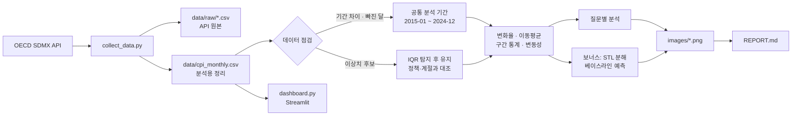

## API 데이터 흐름

```text
OECD SDMX API 요청 키
KOR+USA+GBR+DEU+FRA . M . N . CPI . IX . CP11+CP01+CP045+_T . N . _Z
국가                  주기 방법 측정  단위  항목                  계절조정 변환
   ↓
data/raw/oecd_coicop1999.csv   (일본은 oecd_coicop2018.csv)
   ↓ 필요한 컬럼만 남기고 이름 정리
data/cpi_monthly.csv
   ↓ 날짜 × 나라 표로 변환
전년동월대비 · 3개월 이동평균 · 구간 통계
   ↓
그래프 7개 + REPORT.md
```

## Data Schema

`data/cpi_monthly.csv`는 한 행이 "나라 × 항목 × 월"의 지수 값 하나입니다.

| 컬럼 | 의미 | 예시 |
|---|---|---|
| `country` | 국가 코드 | `KOR` |
| `category` | 항목 (`restaurants_hotels`, `food`, `energy`, `all_items`) | `restaurants_hotels` |
| `date` | 월 (매월 1일) | `2024-01-01` |
| `index` | 물가지수 | `132.3612` |
| `base_period` | 기준연도 (=100) | `2015` |
| `source` | 가져온 데이터셋 | `OECD coicop1999` |

---

# Features

## 1. 데이터 수집

```powershell
python .\collect_data.py
```

인증키 없이 OECD API를 호출해 6개국의 월별 지수를 받습니다. 일본은 COICOP 1999 데이터셋이 2021-06에 끝나서 COICOP 2018 데이터셋에서 가져옵니다.

## 2. 결측치·이상치 처리

| 점검 항목 | 결과 | 처리 |
|---|---|---|
| 빈 값(NaN) | 0건 | - |
| 데이터 종료 시점 | 미국 CP11 2024-12, 프랑스 2025-12, 나머지 2026-07~08 | 분석 기간을 2024-12까지로 제한 |
| 빠진 달 | 미국 전체 CPI·식료품 2025-10 | 분석 기간 밖이라 채우지 않음 |
| 이상치 후보 (IQR) | 한국 17, 프랑스 12, 일본 9, 독일 7, 미국 4, 영국 4건 | 공식 통계라 삭제하지 않고 실제 사건·계절 패턴과 대조 |

## 3. 시계열 분석 기법

| 기법 | 적용 | 이유 |
|---|---|---|
| 변화율 | 전년동월대비 상승률 | 지수 수준이 달라도 비교 가능, 계절성 상쇄 |
| 이동평균 | 상승률의 3개월 이동평균 | 노이즈를 줄이면서 급등 시작 시점은 늦추지 않음 |
| 구간별 통계 | 2015–19 / 2020–21 / 2022–24 평균 | 시기별 상승 속도 비교 |
| 변동성 | 평시 평균 + 2×표준편차 | 나라별 평소 범위를 벗어난 급등 탐지 |
| 사건 전후 비교 | 직전 12개월 vs 직후 12개월 | 사건 이후 상승 속도 변화 |
| 시차 상관 | 에너지·식료품을 0~12개월 늦춰 상관계수 비교 | 원가 상승이 외식 가격에 반영되는 시차 |

## 4. 분석 질문

1. 2015년 이후 한국 외식 물가 상승률은 주요국보다 높았는가?
2. 급등 구간의 시작 시점과 크기는 나라별로 달랐는가? 코로나19(2020.03), 러시아-우크라이나 전쟁(2022.02), 이스라엘-하마스 전쟁(2023.10) 전후로 무엇이 달라졌는가?
3. 전쟁이 영향을 줬다면, 에너지·식료품 가격이 먼저 오르고 외식 물가가 뒤따랐는가?

## 5. 보너스: 대시보드

```powershell
streamlit run .\dashboard.py
```

| 조건 | 선택지 |
|---|---|
| 나라 | 6개국 중 복수 선택 |
| 항목 | 음식 및 숙박 / 식료품 / 에너지 / 전체 CPI |
| 지표 | 지수 / 전년동월대비 상승률 / 3개월 이동평균 |
| 기간 | 2015-01 ~ 2026-08 슬라이더 |
| 보조 옵션 | 시작 월=100 재지수화, 사건 표시, 전후 비교할 사건 |

URL 쿼리로 처음 화면의 조건을 지정할 수 있어서, 아래 [대시보드 시나리오](#dashboard-scenarios)를 같은 화면으로 다시 열어볼 수 있습니다.

배포용으로는 같은 데이터를 쓰는 **정적 웹 대시보드**를 따로 만들어 GitHub Pages에 올렸습니다. 서버가 없어 잠들지 않고 바로 열립니다. → https://qjskffj-code.github.io/codyssey_M1-1/

## 6. 보너스: 시계열 분해와 예측

- **STL 분해:** 6개국의 계절성 강도를 계산하고 한국(0.12)과 프랑스(0.95)를 비교
- **베이스라인 예측:** 단순 / 계절 단순 / 추세 유지 3가지 방식으로 2025년을 예측하고, 이미 발표된 2025년 실제값으로 오차(MAE, MAPE) 평가

---

# Key Findings

자세한 수치와 해석은 [REPORT.md](REPORT.md)에 있습니다.

| # | 관찰 (Fact) | 해석 (가설) |
|---|---|---|
| 1 | 한국 10년 누적 상승률 38.0%, 6개국 중 4위. 같은 기간 한국 전체 CPI는 22.2% | 주요국보다 빨리 오른 것은 아니지만, 자국의 다른 물가보다 빨리 올라 체감 부담이 컸을 수 있다 |
| 2 | 6개국 중 5개국에서 급등이 러-우 전쟁 **이전**(2021년)에 시작. 전쟁 후 12개월 가속은 영국 +7.07%p, 독일 +5.32%p | 급등의 출발점은 코로나 이후 경제 재개이고, 전쟁은 유럽에서 가속 요인이었다 |
| 3 | 유럽은 에너지 상승률이 외식 물가보다 4~7개월 앞섬. 한국은 외식 정점(2022-08)이 에너지 정점(2023-01)보다 먼저 | 유럽은 에너지 비용 전가가 보이지만, 한국 급등은 에너지 외 요인이 더 컸다 |
| 4 | 이-하 전쟁 이후 12개월 동안 6개국 모두 상승률 둔화 | 이 데이터로는 전쟁 영향이 보이지 않는다 (더 큰 물가 둔화 흐름에 가려짐) |
| 5 | 2025년 예측에서 "최근 12개월 기울기 유지"가 5개국 모두 가장 정확 (한국 MAPE 0.43%) | 급등기는 끝났지만 2025년에도 2024년의 상승 속도가 이어졌다 |

---

# Screenshots

분석 그래프는 [`images/`](images/), 대시보드 실행 화면은 [`assets/images/`](assets/images/)에 저장합니다.

## 01. 음식 및 숙박 물가지수 추이

<p align="center">
  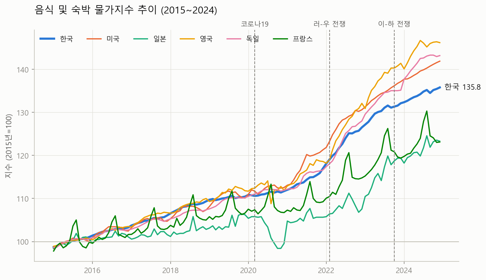
</p>

## 02. 구간별 평균 상승률

<p align="center">
  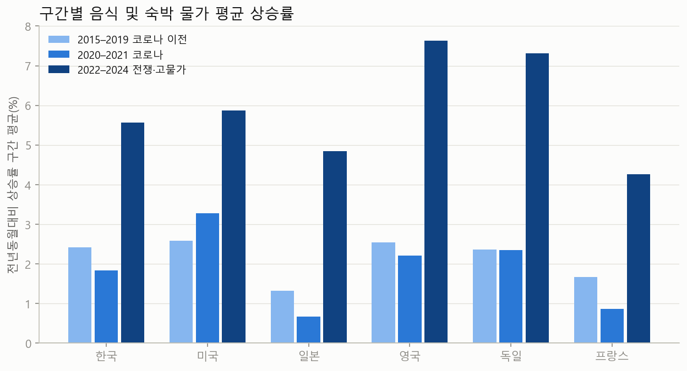
</p>

## 03. 나라별 상승률과 급등 구간

<p align="center">
  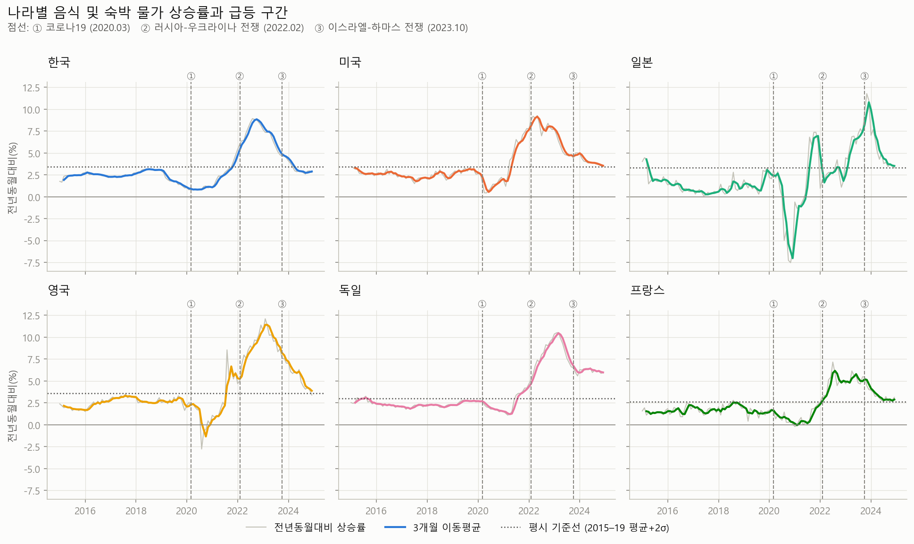
</p>

## 04. 사건 전후 12개월 비교

<p align="center">
  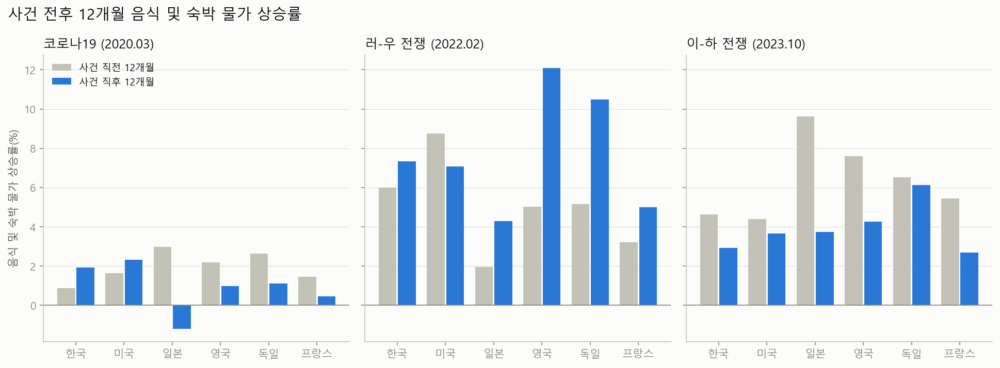
</p>

## 05. 항목별 상승률 정점 시점

<p align="center">
  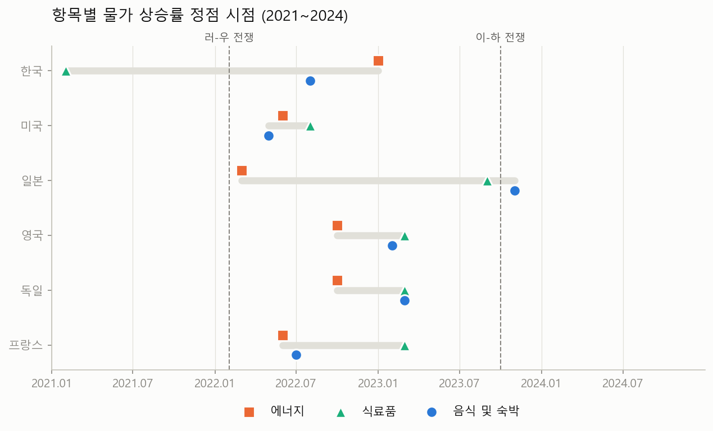
</p>

## 06. 보너스: STL 시계열 분해

<p align="center">
  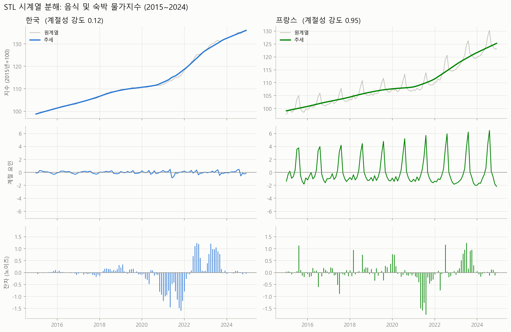
</p>

## 07. 보너스: 베이스라인 예측

<p align="center">
  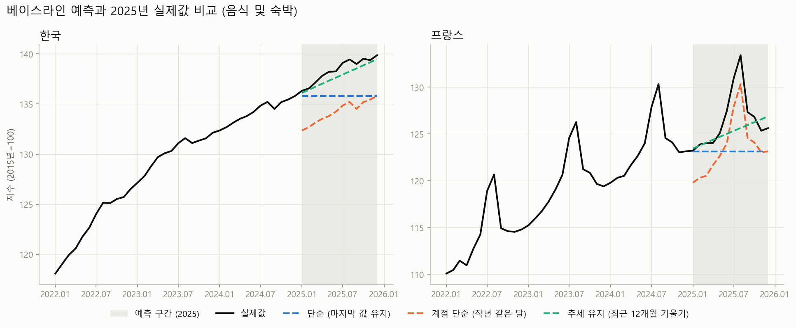
</p>

## 08. 배포된 웹 대시보드 (GitHub Pages)

<p align="center">
  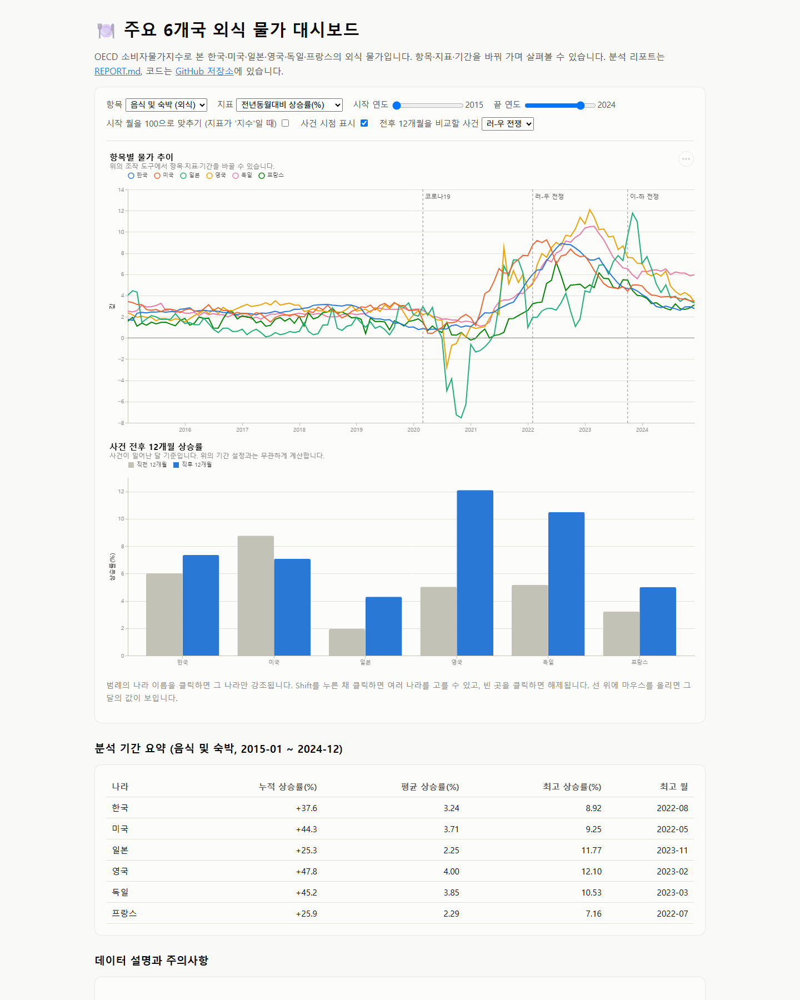
</p>

> 직접 열어 보기: https://qjskffj-code.github.io/codyssey_M1-1/

## Dashboard Scenarios

보너스 과제 제출 방식 (3) **대시보드 스크린샷 세트 + 필터/기간 변경 시나리오 설명**입니다.

| # | 시나리오 | 바꾼 조건 | 확인할 수 있는 것 |
|---|---|---|---|
| 01 | 기본 화면 | 6개국, 음식 및 숙박, 전년동월대비, 2015-01 ~ 2024-12 | 분석 기간 전체의 상승률 흐름과 러-우 전쟁 전후 비교 |
| 02 | 기간 변경 | 지표=지수, 기간=2021-01 ~ 2024-12, 시작 월=100 | 급등기 4년 동안 나라별로 얼마나 올랐는지 같은 출발점에서 비교 |
| 03 | 조건 변경 | 항목=에너지, 나라=한국·영국·독일·프랑스, 기간=2021-01 ~ 2024-12 | 유럽 에너지 급등(영국 최고 88.9%)과 한국의 늦은 정점 비교 |
| 04 | 최신 기간 확장 | 나라=미국 제외 5개국, 지표=3개월 이동평균, 기간=2023-01 ~ 2026-08, 사건=이-하 전쟁 | 분석 기간 이후 흐름과 이-하 전쟁 전후 비교, 데이터가 먼저 끝나는 나라(프랑스) 안내 |

### 01. 기본 화면

```text
http://localhost:8501/
```

> 대시보드의 기간 누적 상승률은 **선택한 기간의 첫 달부터 마지막 달까지**의 지수 변화율입니다. 그래서 한국 +37.6%(2015-01 → 2024-12)는 리포트의 10년 누적 상승률 38.0%(2014-12 → 2024-12)와 조금 다릅니다.

<p align="center">
  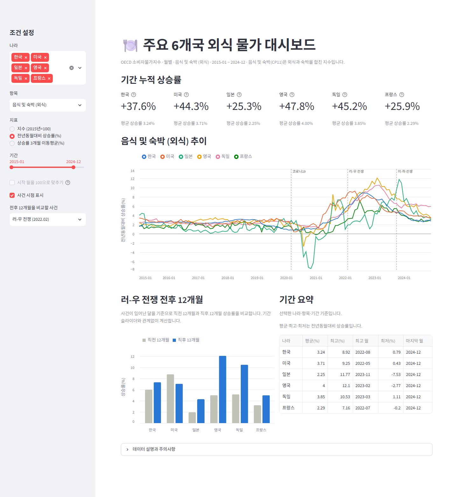
</p>

### 02. 기간 변경: 급등기 누적 상승 비교

```text
http://localhost:8501/?metric=index&rebase=1&start=2021-01&end=2024-12&event=ukraine
```

<p align="center">
  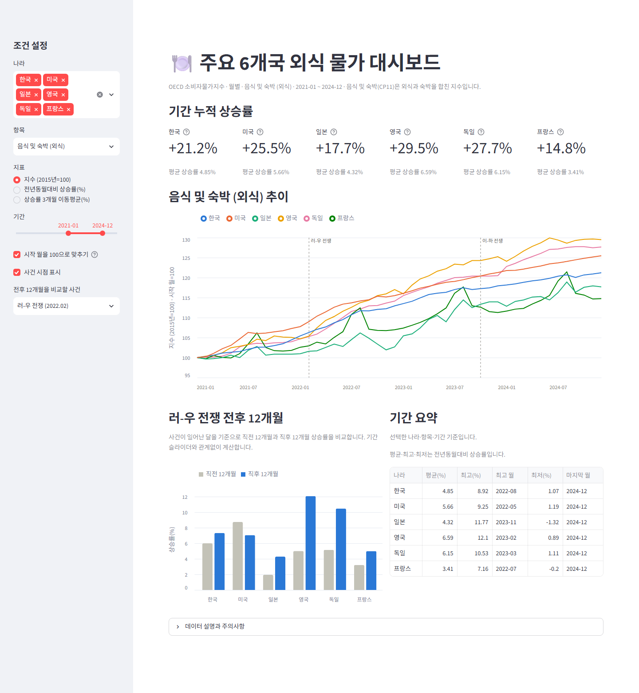
</p>

### 03. 조건 변경: 에너지 물가

```text
http://localhost:8501/?countries=KOR,GBR,DEU,FRA&category=energy&metric=yoy&start=2021-01&end=2024-12&event=ukraine
```

<p align="center">
  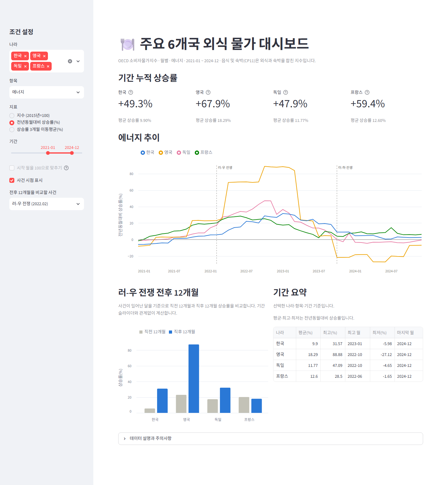
</p>

### 04. 최신 기간 확장: 이스라엘-하마스 전쟁 전후

```text
http://localhost:8501/?countries=KOR,JPN,GBR,DEU,FRA&metric=ma3&start=2023-01&end=2026-08&event=israel
```

<p align="center">
  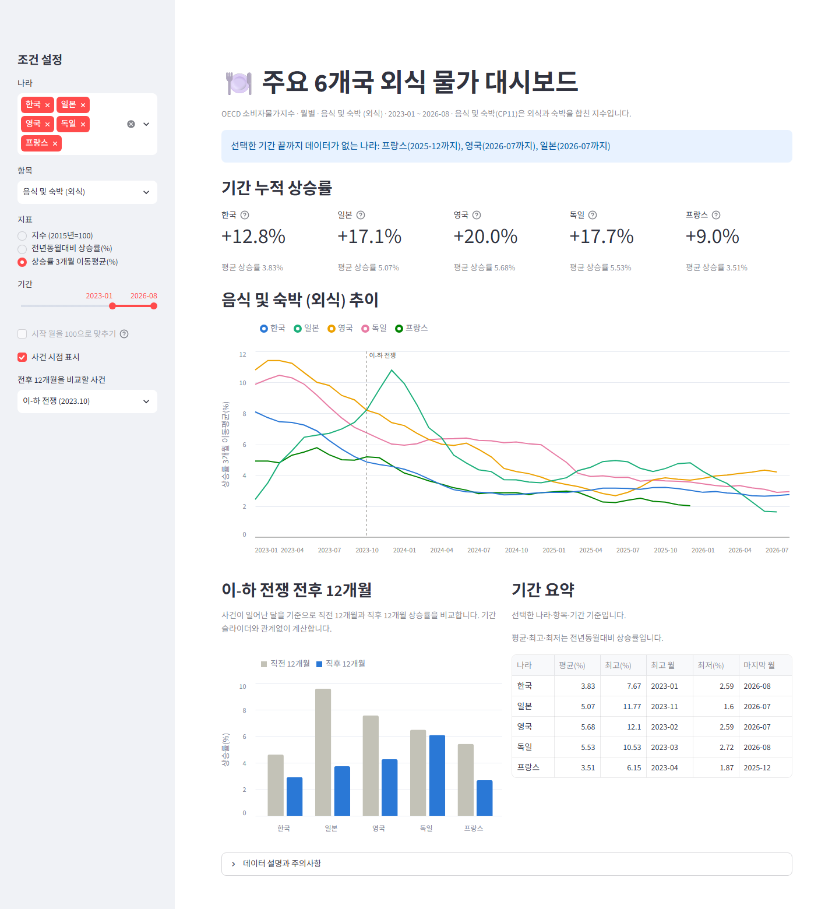
</p>

---

# Project Structure

```text
M1-1/
├── .streamlit/
│   └── config.toml
├── assets/
│   └── images/
│       └── 코디세이_M1-1_대시보드_*.png
├── data/
│   ├── raw/
│   │   ├── oecd_coicop1999.csv
│   │   └── oecd_coicop2018.csv
│   └── cpi_monthly.csv
├── images/
│   ├── 01_index_trend.png
│   ├── 02_period_avg_yoy.png
│   ├── 03_yoy_by_country.png
│   ├── 04_event_before_after.png
│   ├── 05_peak_timing.png
│   ├── 06_stl_decomposition.png
│   └── 07_baseline_forecast.png
├── docs/
│   └── index.html            GitHub Pages로 배포되는 정적 대시보드
├── .gitignore
├── analysis.ipynb
├── build_static_dashboard.py
├── collect_data.py
├── dashboard.py
├── README.md
├── REPORT.md
├── requirements-analysis.txt
└── requirements.txt
```

> `.venv/`는 용량 문제로 저장소에 포함하지 않습니다. 데이터는 크기가 작아 재현을 위해 함께 포함합니다.

---

# How to Run

## 1. 프로젝트 폴더로 이동

```powershell
cd M1-1
```

## 2. 가상환경 생성 및 활성화

```powershell
python -m venv .venv
```

```powershell
.\.venv\Scripts\Activate.ps1
```

PowerShell 실행 정책으로 활성화가 제한되는 경우 현재 터미널에만 다음 설정을 적용합니다.

```powershell
Set-ExecutionPolicy -Scope Process -ExecutionPolicy RemoteSigned
```

그다음 활성화 명령을 다시 실행합니다.

## 3. 패키지 설치

대시보드만 실행하려면 다음을 설치합니다.

```powershell
python -m pip install -r requirements.txt
```

데이터 수집과 분석 노트북까지 실행하려면 다음을 설치합니다.

```powershell
python -m pip install -r requirements-analysis.txt
```

## 4. 데이터 수집

API 키는 필요 없습니다. 저장소에 이미 데이터가 들어 있으므로 최신 데이터로 다시 받고 싶을 때만 실행합니다.

```powershell
python .\collect_data.py
```

## 5. 분석 노트북 실행

노트북을 열어 위에서부터 차례로 실행합니다.

```powershell
jupyter notebook .\analysis.ipynb
```

명령어 한 번으로 전체를 실행하려면 다음을 사용합니다.

```powershell
jupyter nbconvert --to notebook --execute --inplace .\analysis.ipynb
```

> 그래프의 한글은 Windows 기본 글꼴 `Malgun Gothic`으로 표시합니다. macOS에서는 노트북의 `font.family`를 `AppleGothic`으로 바꿉니다.

## 6. 대시보드 실행

```powershell
streamlit run .\dashboard.py
```

브라우저에서 http://localhost:8501 을 엽니다.

## 7. 웹 대시보드 (GitHub Pages)

배포 주소: **https://qjskffj-code.github.io/codyssey_M1-1/**

데이터를 새로 받은 뒤 배포본을 갱신하려면 다시 생성하고 커밋합니다.

```powershell
python .uild_static_dashboard.py
```

`docs/index.html` 한 파일에 데이터가 들어 있어 서버가 필요 없습니다. GitHub Pages는 `main` 브랜치의 `/docs` 폴더를 사용합니다.

## 8. 결과 확인

- `images/` 폴더: 분석 그래프 7개
- `REPORT.md`: 분석 리포트

---

# Data Design

## 데이터 출처와 라이선스

| 항목 | 내용 |
|---|---|
| 출처 | OECD Data Explorer, *Consumer price indices (CPIs, HICPs)* |
| 데이터셋 | COICOP 1999 (`DSD_PRICES@DF_PRICES_ALL`), COICOP 2018 (`DSD_PRICES_COICOP2018@DF_PRICES_C2018_ALL`) |
| API | `https://sdmx.oecd.org/public/rest/data/...` (인증키 불필요) |
| 수집일 | 2026-09-15 |
| 라이선스 | CC BY 4.0. 재사용할 때는 출처(OECD)를 표기해야 하며, 이용 조건은 OECD 웹사이트의 최신 약관을 확인합니다. |

> OECD는 과거 값을 수정할 수 있어서, 다른 날짜에 다시 수집하면 수치가 조금 다를 수 있습니다.

## 외식 물가 지표로 CP11을 사용한 이유

나라 간 같은 기준으로 비교할 수 있는 OECD 분류에는 "외식"만 따로 떼어낸 항목이 없습니다. 그래서 **음식 및 숙박(CP11)** 을 외식 물가의 대리 지표로 사용했습니다. 숙박이 섞여 있다는 한계는 STL 분해에서 프랑스의 강한 여름철 계절성(강도 0.95)으로도 확인됩니다.

---

# Verification

| 검증 항목 | 입력 또는 조건 | 기대 결과 | 결과 |
|---|---|---|---|
| 수집값 정확성 | 한국 CP11 2024-01, API 직접 조회값과 비교 | 132.3612로 일치 | PASS |
| 기준연도 | 나라별 2015년 평균 지수 | 100 | PASS |
| 분석 기간 결측 | 2014-01 ~ 2024-12, 4개 항목 × 6개국 | 결측 0건 | PASS |
| 빠진 달 탐지 | 전체 수집 기간 날짜 대조 | 미국 2025-10 발견 | PASS |
| 노트북 재현 | 커널 재시작 후 전체 실행 | 에러 0건, 그래프 7개 생성 | PASS |
| 리포트 이미지 링크 | `REPORT.md`의 이미지 경로 | 모든 파일 존재 | PASS |
| 예측 평가 분리 | 2025년 데이터를 학습에 사용하지 않음 | 2025년 실제값으로만 오차 계산 | PASS |
| 대시보드 실행 | 기본 조건으로 접속 | 브라우저 콘솔 에러 없음 | PASS |
| 대시보드 데이터 부족 안내 | 기간 끝 2026-08, 프랑스 포함 | "기간 끝까지 데이터가 없는 나라" 안내 표시 | PASS |
| 웹 대시보드 필터 | 항목=에너지, 지표=지수, 시작 월 100 맞추기 | 모든 나라가 100에서 시작하도록 다시 계산 | PASS |
| 배포 확인 | GitHub Pages 주소 접속 | HTTP 200, 그래프 정상 표시 | PASS |

---

# 공식 미션 요구사항 체크리스트

## 최종 결과물

- [x] 시계열 데이터 1개 선정, 데이터 포인트 100개 이상 (720개)
- [x] `REPORT.md`에 분석 주제, 질문, 데이터 설명, 시각화, 인사이트, 결론/한계점 포함
- [x] 시각화 2개 이상 (필수) + 추가 1개 이상 (권장) → 7개
- [x] Python 코드 (`collect_data.py`, `analysis.ipynb`)
- [x] 코드, 리포트, 데이터, 데이터 수집 방법 문서 포함

## 기능 요구사항

- [x] 데이터 출처와 기간 명시
- [x] 분석 질문 3개 이상
- [x] 데이터 기본 정보(기간, 컬럼, 결측치) 확인
- [x] 결측치·이상치 처리 기준 설정
- [x] 시계열 분석 기법 2가지 이상 (변화율, 이동평균, 구간별 통계, 변동성)
- [x] 인사이트 3개 이상, 각 인사이트에 관찰 수치 포함

## 제약 사항

- [x] 의존성 목록 `requirements.txt`
- [x] 실행 방법 문서화
- [x] 데이터 출처·수집 방법·라이선스 주의 문구
- [x] 그래프만 나열하지 않고 인사이트 해석 포함
- [x] 관찰(근거)과 해석(가설) 구분
- [x] AI 사용 로그 (사용 작업, 사용 이유, 검증 방법)

## Bonus

- [x] 분석 결과 서비스화: 기간/조건을 바꿔 보는 웹 대시보드
- [x] 제출 방식 (3) 대시보드 스크린샷 세트 + 필터/기간 변경 시나리오 설명
- [x] (A) 시계열 분해: 추세/계절성 분리 및 해석
- [x] (B) 간단 예측: 베이스라인 방식 예측, 가정/한계 설명
- [x] 대시보드 배포 URL: https://qjskffj-code.github.io/codyssey_M1-1/

---

# Key Decisions

## 공통 분석 기간을 2024년까지로 자른 이유

일부 나라는 2026년 데이터까지 있지만, 미국의 음식 및 숙박 지수는 2024-12에서 끝납니다. 최신 데이터를 최대한 쓰면 나라마다 비교 기간이 달라져 "누가 더 올랐나"를 공정하게 말할 수 없습니다. 그래서 본 분석은 6개국 공통 기간으로 하고, 2025년 이후 흐름은 대시보드와 예측 검증에서 따로 확인했습니다.

## 이상치를 삭제하지 않은 이유

이상치 후보는 대부분 영국 부가세 인하, 일본 여행 보조금, 프랑스 여름 휴가철처럼 설명 가능한 실제 움직임이었습니다. 공식 통계에서 이런 값을 지우면 분석하려는 급등 자체가 사라집니다. 그래서 값은 유지하고, 전년동월대비 변화율과 이동평균으로 영향을 줄였습니다.

## 이동평균을 3개월로 잡은 이유

12개월 이동평균은 매끄럽지만 급등 시작이 몇 달 늦게 잡힙니다. 이 프로젝트는 "사건 전에 시작됐나, 후에 시작됐나"가 중요해서, 노이즈를 줄이면서 시점 왜곡이 작은 3개월을 선택했습니다.

## 예측을 이미 발표된 2025년 값으로 평가한 이유

미래를 예측만 하면 맞았는지 확인할 수 없습니다. 2024년까지만 학습하고 2025년 실제값과 비교하면, 각 방식의 가정("더 오르지 않는다", "작년과 같다", "최근 속도가 이어진다")이 실제로 얼마나 맞았는지 수치로 확인할 수 있습니다.

---

# What I Learned

- 같은 "물가 상승"도 지수 수준, 전년동월대비, 이동평균 중 무엇으로 보느냐에 따라 결론이 달라질 수 있어서, **지표를 고른 이유를 먼저 설명해야 한다**는 점을 배웠습니다.
- 데이터 기간이 나라마다 다르다는 사실은 그래프가 아니라 **날짜 하나하나를 대조하는 점검 과정**에서 드러났습니다.
- 이상치는 지워야 할 오류가 아니라 **정책이나 계절 패턴을 발견하는 단서**가 될 수 있었습니다.
- "전쟁 때문에 올랐다"는 통념도 급등 시작 시점을 확인하니 절반만 맞았습니다. **시점과 순서를 확인하는 것만으로도 원인 단정을 피할 수 있었습니다.**
- AI가 만든 코드와 해석도 API 원본값 대조, 전체 재실행, 그래프 확인으로 **직접 검증해야 결론으로 쓸 수 있다**는 점을 확인했습니다.

## Limitations & Future Work

- CP11은 외식과 숙박을 합친 지수입니다. KOSIS의 한국 "외식" 지수(숙박 제외)로 한국 결과를 교차 검증할 수 있습니다.
- 사건 전후 비교와 시차 상관은 인과관계를 증명하지 않습니다. 금리, 환율, 임금, 방역 정책 같은 변수를 함께 넣은 분석이 필요합니다.
- 전년동월대비 상승률은 이웃한 달끼리 값이 비슷해 상관계수가 높게 나올 수 있습니다.
- 예측은 2025년 한 해로만 평가했고 오차 범위를 계산하지 않았습니다. 계절성과 추세를 함께 쓰는 모델(예: SARIMA, ETS)과 여러 해 교차 검증을 추가할 수 있습니다.
- 배포한 정적 대시보드는 브라우저에서만 계산하므로, 데이터가 커지면 페이지 용량(현재 약 365KB)이 함께 커집니다. 데이터를 별도 파일로 분리해 불러오는 방식이 필요할 수 있습니다.

## 한 줄 회고

> 그래프를 그리는 데서 끝내지 않고, **데이터를 점검하고 관찰과 가설을 나눠서 "그래서 이게 무슨 의미인가"에 답하는 과정**을 직접 완성했습니다.

---

# Deliverables

| 결과물 | 경로 |
|---|---|
| 분석 리포트 | `REPORT.md` |
| 분석 노트북 | `analysis.ipynb` |
| 데이터 수집 스크립트 | `collect_data.py` |
| 원본 데이터 | `data/raw/oecd_coicop1999.csv`, `data/raw/oecd_coicop2018.csv` |
| 분석용 데이터 | `data/cpi_monthly.csv` |
| 분석 그래프 | `images/01_index_trend.png` ~ `images/07_baseline_forecast.png` |
| 대시보드 (로컬 실행) | `dashboard.py` |
| 웹 대시보드 (배포) | `build_static_dashboard.py` → `docs/index.html` |
| 대시보드 스크린샷 | `assets/images/코디세이_M1-1_대시보드_*.png` |
| 의존성 목록 | `requirements.txt` (대시보드), `requirements-analysis.txt` (수집·분석) |
| 프로젝트 문서 | `README.md` |
